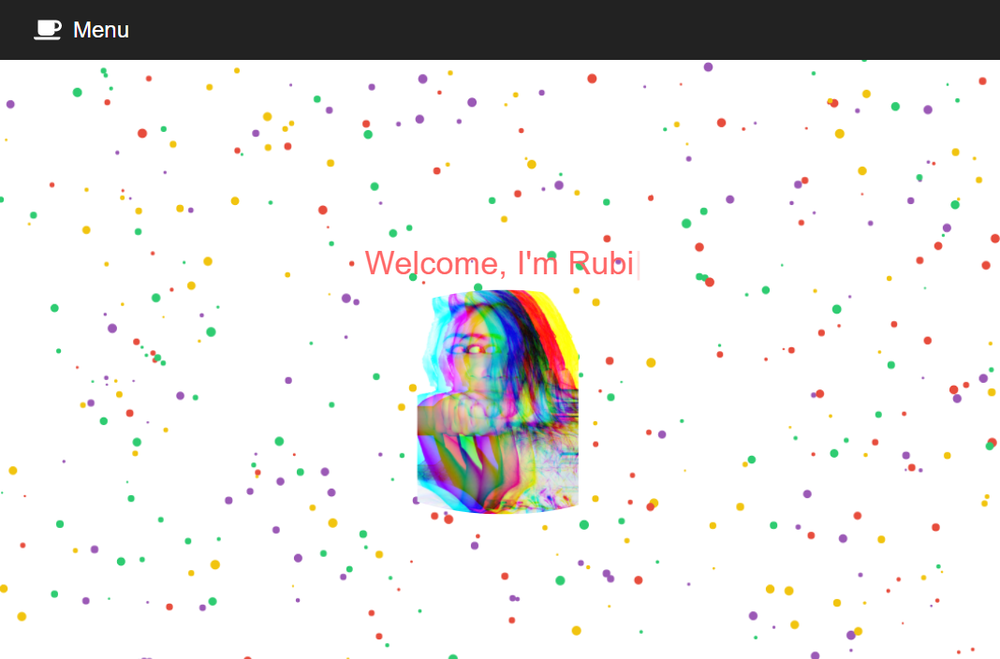

# Rubi's React Full-Stack Web Developer Portfolio.v01
 
Built with React, MaterialUI, JavaScript, and Fontawesome.

Deployed Website: 

GitHub Repository: https://github.com/rubiocode/ReactPortfolio.v1

## Table of Contents 

* [Description](#description)
* [View](#view)
* [Usage](#usage)
* [Future Improvements](#future-improvements)
* [Built With](#built-with)
* [Credits](#credits)
* [License](#license)

## Description 

I used React and MaterialUI Framework to create a mobile responsive portfolio with the following items: navbar, responsive layout, and responsive images. 

> A responsive design ensures that web applications are rendered well on a variety of devices and window or screen sizes.

### Minimum Requirements Met for a Responsive Portfolio
- [x] Functional, deployed application
- [x] GitHub repository with README describing the project
- [x] Navbar consistent on each page.
- [x] Navbar on each page contain links to Homepage, About Me, Contact Me, and Portfolio pages.
- [x] All links work.
- [x] Contains some personal information.

## View

To view my latest portfolio click [here](), which will lead you to the homepage.

## Usage 
Click through tabs/buttons to view the content of the pages.

**Video of the App**

This [video](https://drive.google.com/file/d/1mjMljRYjpL7q82vkzJYVWwkzb0Q7jCIT/view) demonstrates application functionality.

### Homepage

## Future Improvements

Future improvements to this portfolio:

Functional 'Contact Me' form

## Built With

* [HTML](https://html.spec.whatwg.org/) - Markup language used to define the structure of webpage. Semantic HTML elements were introduced in HTML5. 
* [CSS](https://www.w3.org/Style/CSS/) - Style sheet language used to add style to markup languages like HTML. 
* [React](https://reactjs.org/) - A JavaScript library for building user interfaces
* [JavaScript](https://developer.mozilla.org/en-US/docs/Web/JavaScript) - Programming language that creates dynamic website content. Used in this project to filter projects and add typewriter effect to homepage.
* [FontAwesome](https://fontawesome.com/) - Library for icons and fonts.
* [Material UI](https://next.material-ui.com/) - A simple and customizable component library to build faster, beautiful, and more accessible React applications. 
* [Node.js](https://nodejs.dev/learn/) - Node.js is an open-source, low-level, back-end JavaScript runtime platform that uses asynchronous programming and is a popular tool for almost any kind of project!.

## Credits

*  Youtube [80/20 Coding](https://www.youtube.com/channel/UCobZg0ym72ZZPqOQNB_qJnw). 

## License

Copyright 2021 Rubidia Rubio. Licensed under the [MIT License](https://opensource.org/licenses/MIT)

All Rights Reserved. Permission is hereby granted, free of charge, to any person obtaining a copy of this software and associated documentation files (the "Software"), to deal in the Software without restriction, including without limitation the rights to use, copy, modify, merge, publish, distribute, sublicense, and/or sell copies of the Software, and to permit persons to whom the Software is furnished to do so, subject to the following conditions:

The above copyright notice and this permission notice shall be included in all copies or substantial portions of the
Software.

THE SOFTWARE IS PROVIDED "AS IS", WITHOUT WARRANTY OF ANY KIND, EXPRESS OR IMPLIED, INCLUDING BUT NOT LIMITED TO THE
WARRANTIES OF MERCHANTABILITY, FITNESS FOR A PARTICULAR PURPOSE AND NONINFRINGEMENT. IN NO EVENT SHALL THE AUTHORS OR
COPYRIGHT HOLDERS BE LIABLE FOR ANY CLAIM, DAMAGES OR OTHER LIABILITY, WHETHER IN AN ACTION OF CONTRACT, TORT OR
OTHERWISE, ARISING FROM, OUT OF OR IN CONNECTION WITH THE SOFTWARE OR THE USE OR OTHER DEALINGS IN THE SOFTWARE.